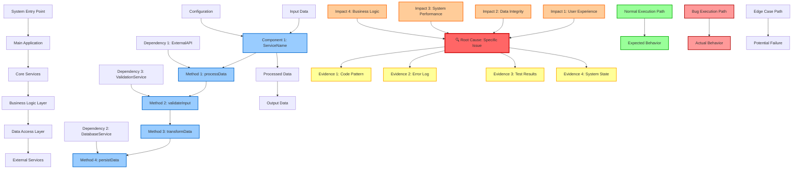

# Deep Bug Analysis with Execution Graph Protocol

## Overview

Execute comprehensive bug analysis using systematic root cause analysis with evidence-based investigation, culminating in a detailed execution graph visualization. This command provides thorough bug insights with complete understanding of the code ecosystem and generates a comprehensive execution graph showing the LLM's detailed reasoning path.

## Mission Briefing: Deep Bug Analysis with Execution Graph Protocol

**ANALYSIS COMMAND DETECTION:** Before proceeding with analysis, check if the provided text contains any `/analyze*` command (e.g., `/analyze-general`, `/analyze-code`, `/analyze-project`, `/analyze-bug-*`, etc.). If found, skip this command's analysis and execute the detected command instead to avoid duplicate analysis.

You will now execute a comprehensive bug analysis using the **AUTONOMOUS PRINCIPAL ENGINEER - OPERATIONAL DOCTRINE.** This analysis follows systematic root cause analysis principles for complete bug understanding and generates a comprehensive execution graph showing the LLM's detailed reasoning path. The goal is to identify the definitive root cause through systematic analysis and visualize the complete execution flow.

---

## **Phase 0: Reconnaissance & State Baseline (Read-Only)**

**Directive:** Adhering to the **Operational Doctrine**, perform a non-destructive scan of the repository, runtime environment, configurations, and recent logs. Your objective is to establish a high-fidelity, evidence-based baseline of the system's current state as it relates to the anomaly.

**Comprehensive Analysis Scope:**

- **Repository State**: Complete codebase analysis, recent changes, and current state
- **Runtime Environment**: System configuration, environment variables, and runtime state
- **Configuration Analysis**: All configuration files, build settings, and deployment configs
- **Log Analysis**: Recent logs, error messages, and system events
- **Dependency State**: All dependencies, versions, and compatibility status

**Graph Node Creation:**
- Create system state nodes
- Map configuration dependencies
- Document runtime environment
- Identify system boundaries

**Output:** Produce a concise digest (≤ 200 lines) of your findings.

**Constraint:** **No mutations are permitted during this phase.**

---

## **Phase 1: Isolate the Anomaly**

**Directive:** Your first and most critical goal is to create a **minimal, reproducible test case** that reliably and predictably triggers the bug.

**Actions:**
1. **Define Correctness:** Clearly state the expected, non-buggy behavior
2. **Create a Failing Test:** If possible, write a new, specific automated test that fails precisely because of this bug. This test will become your signal for success
3. **Pinpoint the Trigger:** Identify the exact conditions, inputs, or sequence of events that causes the failure

**Graph Node Creation:**
- Add test case nodes
- Map trigger conditions
- Document expected vs actual behavior
- Highlight failure points

**Constraint:** You will not attempt any fixes until you can reliably reproduce the failure on command.

---

## **Phase 2: Root Cause Analysis (RCA)**

**Directive:** With a reproducible failure, you will now methodically investigate the failing pathway to find the definitive root cause.

**Evidence-Gathering Protocol:**
1. **Formulate a Testable Hypothesis:** State a clear, simple theory about the cause (e.g., "Hypothesis: The user authentication token is expiring prematurely.")
2. **Devise an Experiment:** Design a safe, non-destructive test or observation to gather evidence that will either prove or disprove your hypothesis
3. **Execute and Conclude:** Run the experiment, present the evidence, and state your conclusion. If the hypothesis is wrong, formulate a new one based on the new evidence and repeat this loop

**Graph Node Creation:**
- Add hypothesis nodes
- Map evidence collection paths
- Document experimental results
- Highlight confirmed root causes

**Anti-Patterns (Forbidden Actions):**
- **FORBIDDEN:** Applying a fix without a confirmed root cause supported by evidence
- **FORBIDDEN:** Re-trying a previously failed fix without new data
- **FORBIDDEN:** Patching a symptom (e.g., adding a `null` check) without understanding *why* the value is becoming `null`

---

## **Phase 3: Comprehensive System Analysis**

**Directive:** Perform deep analysis of the entire system to understand the complete context and impact of the root cause.

**System Analysis Areas:**

1. **Code Architecture Analysis**:
   - Complete system architecture mapping
   - Component relationships and dependencies
   - Data flow and communication patterns
   - Integration points and boundaries

2. **Dependency Ecosystem Analysis**:
   - All direct and transitive dependencies
   - Version compatibility and conflicts
   - API changes and breaking changes
   - External service dependencies

3. **Business Logic Deep Dive**:
   - Complete business rule analysis
   - Algorithm complexity and correctness
   - Data validation and transformation logic
   - Error handling and recovery patterns

4. **Performance and Resource Analysis**:
   - Memory usage patterns
   - CPU utilization and bottlenecks
   - Network and I/O operations
   - Caching and optimization strategies

**Graph Node Creation:**
- Add system architecture nodes
- Map complete dependency tree
- Document business logic flows
- Highlight performance bottlenecks

**Output:** Complete understanding of the system and root cause impact.

---

## **Phase 4: Execution Graph Generation**

**Directive:** Generate a comprehensive execution graph showing the complete system flow, root cause location, and detailed reasoning path.

**Graph Structure:**

**Graph Components:**

1. **System Architecture**: Complete system structure and component relationships
2. **Detailed Component Flow**: Step-by-step execution within components
3. **Data Flow**: How data moves through the system
4. **Dependencies**: All external dependencies and their relationships
5. **Root Cause Analysis**: Identified root cause with supporting evidence
6. **Impact Analysis**: How the root cause affects different system areas
7. **Execution Paths**: Normal, bug, and edge case execution paths

---

## **Phase 5: Detailed Analysis Report**

**Directive:** Present comprehensive findings with the execution graph and detailed reasoning.

**Report Structure:**

### **Execution Graph Visualization**
- **Mermaid Graph**: Complete system flow with root cause location
- **Legend**: Explanation of node types and colors
- **Flow Description**: Detailed explanation of all execution paths

### **Root Cause Analysis Summary**
- **Confirmed Root Cause:** Definitive statement of the underlying issue
- **Supporting Evidence:** Key evidence from RCA that proves the root cause
- **Impact Analysis:** How this root cause affects the system and users
- **Scope of Impact:** Which components and users are affected

### **System Analysis Results**
- **Architecture Overview**: Complete system structure and relationships
- **Dependency Analysis**: All dependencies and their impact on the bug
- **Business Logic Analysis**: How business rules contribute to the issue
- **Performance Impact**: How the bug affects system performance

### **Execution Flow Analysis**
- **Normal Flow**: How the system should execute under normal conditions
- **Bug Flow**: How the system executes when the bug occurs
- **Critical Paths**: Most likely paths where the bug manifests
- **Edge Cases**: Unusual execution paths that might trigger the bug

### **Evidence Chain**
1. **Evidence 1**: [First piece of evidence]
2. **Evidence 2**: [Second piece of evidence]
3. **Evidence 3**: [Third piece of evidence]
4. **Evidence 4**: [Fourth piece of evidence]
5. **Conclusion**: [How evidence leads to root cause]

### **Impact Assessment**
- **User Impact**: How users are affected by the bug
- **System Impact**: How the system is affected by the bug
- **Business Impact**: How business operations are affected
- **Technical Impact**: How technical operations are affected

### **Recommended Next Steps**
1. **Immediate Actions**: [What to do first]
2. **Investigation Steps**: [How to confirm the root cause]
3. **Testing Strategy**: [How to reproduce and verify the fix]
4. **Monitoring**: [What to watch for after implementation]

---

## **Usage Examples**

- `/analyze-bug-with-graph-deep Analyze the UserService.ts file for authentication issues`
- `/analyze-bug-with-graph-deep Investigate the DataProcessor class for data corruption bugs`
- `/analyze-bug-with-graph-deep Analyze the PaymentHandler for transaction processing errors`
- `/analyze-bug-with-graph-deep Investigate the FileUploader component for upload failures`

## **Analysis Features**

- **Comprehensive Analysis**: Complete system understanding with full context
- **Execution Graph**: Visual representation of complete system flow and root cause
- **Root Cause Analysis**: Systematic approach to finding the definitive cause
- **Evidence-Based Reasoning**: All conclusions supported by concrete evidence
- **Impact Assessment**: Complete understanding of bug impact across all areas
- **Visual Reasoning**: Clear visualization of the LLM's detailed thought process
- **System-Wide Understanding**: Complete ecosystem analysis and relationships

**Remember**: This command provides comprehensive bug analysis with complete system understanding. The execution graph visualizes the detailed reasoning path and makes it easy to understand the complete system flow and how the root cause manifests.
