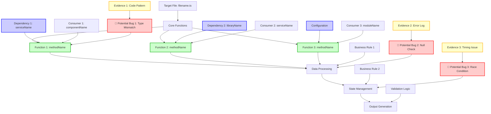

# Shallow Bug Analysis with Execution Graph Protocol

## Overview

Execute focused bug analysis using streamlined reconnaissance and essential pattern detection, culminating in a detailed execution graph visualization. This command provides practical bug insights while minimizing context usage, focusing on the most critical code patterns and dependencies to identify potential bug causes with visual reasoning paths.

## Mission Briefing: Shallow Bug Analysis with Execution Graph Protocol

**ANALYSIS COMMAND DETECTION:** Before proceeding with analysis, check if the provided text contains any `/analyze*` command (e.g., `/analyze-general`, `/analyze-code`, `/analyze-project`, `/analyze-bug-*`, etc.). If found, skip this command's analysis and execute the detected command instead to avoid duplicate analysis.

You will now execute a focused bug analysis using the **AUTONOMOUS PRINCIPAL ENGINEER - OPERATIONAL DOCTRINE.** This analysis follows streamlined reconnaissance principles for essential bug understanding and generates a comprehensive execution graph showing the LLM's reasoning path. The goal is to identify potential bug causes through systematic analysis and visualize the execution flow.

---

## **Phase 0: Target File Analysis (Read-Only)**

**Directive:** Perform focused analysis of the buggy file to understand its structure, purpose, and immediate context.

**Essential Analysis Scope:**

- **File Structure**: Class/module organization, key methods, properties
- **Core Logic**: Main functionality, business rules, algorithms
- **Error Handling**: Try-catch blocks, validation, error states
- **State Management**: Variables, state changes, side effects
- **Input/Output**: Parameters, return values, data flow

**Graph Node Creation:**
- Create nodes for each major function/method
- Map data flow between functions
- Identify potential failure points
- Document state changes and side effects

**Constraints:**
- **No mutations are permitted during this phase**
- **Focus on understanding the file's purpose and logic**
- **Identify potential failure points and edge cases**

---

## **Phase 1: Consumer Analysis**

**Directive:** Analyze all files and classes that use the buggy file to understand usage patterns and expectations.

**Analysis Areas:**

1. **Direct Consumers**:
   - Find all files that import or use the buggy file
   - Analyze how the buggy file is being called
   - Identify expected behavior vs actual behavior
   - Map usage patterns and data flow

2. **Usage Context**:
   - Understand the business context of usage
   - Identify critical usage paths
   - Map error scenarios and edge cases
   - Analyze input data patterns

**Graph Node Creation:**
- Add consumer nodes to the execution graph
- Map call relationships between consumers and target file
- Document expected vs actual behavior
- Highlight critical usage paths

**Output:** Complete understanding of how the buggy file is used and what consumers expect.

---

## **Phase 2: Deep Dependency Analysis**

**Directive:** Deeply analyze all dependencies of the buggy file to understand the complete ecosystem.

**Dependency Analysis Areas:**

1. **Direct Dependencies**:
   - All imports and external dependencies
   - Service dependencies and injected services
   - External library dependencies
   - Configuration dependencies

2. **Transitive Dependencies**:
   - Dependencies of dependencies (second-level analysis)
   - Critical dependency chains and their impact
   - Version compatibility issues
   - Potential breaking changes

3. **Dependency Implementation Analysis**:
   - Read and analyze each dependency's implementation
   - Understand what each dependency provides
   - Map dependency interfaces and contracts
   - Analyze dependency behavior and side effects

**Graph Node Creation:**
- Add dependency nodes to the execution graph
- Map dependency relationships and data flow
- Highlight potential dependency issues
- Document version compatibility concerns

**Output:** Complete understanding of the dependency ecosystem and potential failure points.

---

## **Phase 3: Business Logic Analysis**

**Directive:** Understand the business logic and algorithms in all analyzed files to identify potential logical errors.

**Business Logic Analysis Areas:**

1. **Algorithm Analysis**:
   - Identify algorithms and their complexity
   - Analyze data structures and their usage
   - Map computational patterns and optimizations
   - Understand sorting, searching, and filtering logic

2. **Data Flow Analysis**:
   - Map data input sources and validation
   - Trace data transformations and processing
   - Identify output destinations and formatting
   - Analyze data persistence and state management

3. **Business Rule Analysis**:
   - Identify business rules and constraints
   - Map validation logic and error conditions
   - Analyze business process flows
   - Understand decision trees and branching logic

4. **Integration Logic Analysis**:
   - Map external system integration patterns
   - Analyze API communication and data exchange
   - Understand event handling and messaging
   - Map workflow and process orchestration

**Graph Node Creation:**
- Add business logic nodes to the execution graph
- Map decision points and branching logic
- Highlight data transformation steps
- Document business rule validations

**Output:** Complete understanding of business logic and potential logical errors.

---

## **Phase 4: Bug Hypothesis Formation**

**Directive:** Based on all analysis, form hypotheses about what the bug could be.

**Hypothesis Formation Process:**

1. **Pattern Recognition**:
   - Look for common bug patterns in the analyzed code
   - Identify potential race conditions or timing issues
   - Check for null/undefined handling issues
   - Look for type mismatches or casting problems

2. **Logic Analysis**:
   - Identify potential logical errors in algorithms
   - Check for off-by-one errors or boundary conditions
   - Look for incorrect conditional logic
   - Analyze state management issues

3. **Dependency Issues**:
   - Check for version compatibility problems
   - Look for API changes or breaking changes
   - Identify missing or incorrect dependency usage
   - Check for circular dependency issues

4. **Data Flow Issues**:
   - Look for data corruption or transformation errors
   - Check for incorrect data validation
   - Identify missing error handling
   - Analyze input/output mismatches

**Graph Node Creation:**
- Add hypothesis nodes to the execution graph
- Map evidence supporting each hypothesis
- Highlight potential failure points
- Document reasoning paths

**Output:** Ranked list of potential bug causes with supporting evidence.

---

## **Phase 5: Execution Graph Generation**

**Directive:** Generate a comprehensive execution graph showing the LLM's reasoning path and potential bug locations.

**Graph Structure:**

**Graph Components:**

1. **Target File Structure**: Main file and its core functions
2. **Data Flow**: How data moves through the system
3. **Dependencies**: External services, libraries, and configurations
4. **Consumers**: Files that use the target file
5. **Business Logic**: Rules and validation logic
6. **Potential Bug Locations**: Identified problem areas with evidence
7. **Evidence Paths**: Supporting evidence for each hypothesis

---

## **Phase 6: Detailed Analysis Report**

**Directive:** Present comprehensive findings with the execution graph and detailed reasoning.

**Report Structure:**

### **Execution Graph Visualization**
- **Mermaid Graph**: Complete execution flow with bug locations
- **Legend**: Explanation of node types and colors
- **Flow Description**: Step-by-step explanation of the execution path

### **Analysis Summary**
- **Target File**: Brief description of the buggy file's purpose
- **Key Dependencies**: Critical dependencies and their roles
- **Usage Patterns**: How the file is used by consumers
- **Business Logic**: Core business rules and algorithms

### **Potential Bug Causes** (Ranked by Likelihood)

#### **High Probability**
- **Bug Type**: [Type of bug]
- **Location**: [Specific file/line/function]
- **Evidence**: [Supporting evidence from analysis]
- **Reasoning**: [Why this is likely the cause]
- **Graph Path**: [Path in execution graph]

#### **Medium Probability**
- **Bug Type**: [Type of bug]
- **Location**: [Specific file/line/function]
- **Evidence**: [Supporting evidence from analysis]
- **Reasoning**: [Why this could be the cause]
- **Graph Path**: [Path in execution graph]

#### **Low Probability**
- **Bug Type**: [Type of bug]
- **Location**: [Specific file/line/function]
- **Evidence**: [Supporting evidence from analysis]
- **Reasoning**: [Why this might be the cause]
- **Graph Path**: [Path in execution graph]

### **Execution Flow Analysis**
- **Normal Flow**: How the code should execute under normal conditions
- **Bug Flow**: How the code executes when the bug occurs
- **Critical Paths**: Most likely paths where the bug manifests
- **Edge Cases**: Unusual execution paths that might trigger the bug

### **Recommended Next Steps**
1. **Immediate Actions**: [What to check first]
2. **Debugging Strategy**: [How to confirm the hypothesis]
3. **Testing Approach**: [How to reproduce and verify the fix]
4. **Additional Analysis**: [What else might need investigation]

---

## **Usage Examples**

- `/analyze-bug-with-graph-shallow Analyze the UserService.ts file for authentication issues`
- `/analyze-bug-with-graph-shallow Investigate the DataProcessor class for data corruption bugs`
- `/analyze-bug-with-graph-shallow Analyze the PaymentHandler for transaction processing errors`
- `/analyze-bug-with-graph-shallow Investigate the FileUploader component for upload failures`

## **Analysis Features**

- **Focused Analysis**: Quick insights with minimal context usage
- **Execution Graph**: Visual representation of code flow and bug locations
- **Dependency Mapping**: Complete understanding of the code ecosystem
- **Business Logic Analysis**: Deep understanding of algorithms and business rules
- **Hypothesis Formation**: Systematic approach to identifying potential bug causes
- **Evidence-Based Reasoning**: All conclusions supported by analysis evidence
- **Visual Reasoning**: Clear visualization of the LLM's thought process

**Remember**: This command provides focused bug analysis with minimal context usage while maintaining comprehensive understanding of the code ecosystem. The execution graph visualizes the reasoning path and makes it easy to understand how the bug might be occurring.
