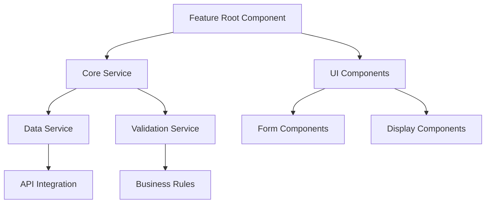
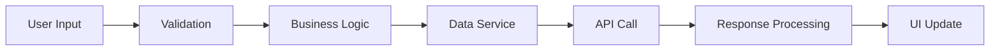
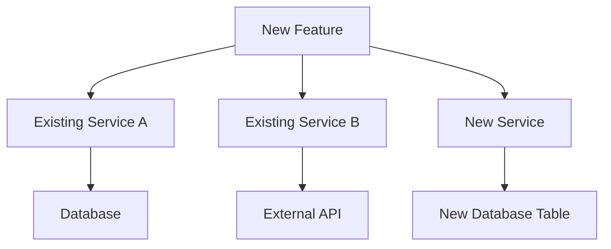

# Feature Design Protocol

## Overview

Execute comprehensive feature design using systematic analysis, requirements gathering, and visual design presentation. This command creates a complete design specification that can be used by the `/implement-feature` command for implementation.

## Mission Briefing: Feature Design Protocol

**ANALYSIS COMMAND DETECTION:** Before proceeding with design, check if the provided text contains any `/analyze*` command (e.g., `/analyze-general`, `/analyze-code`, `/analyze-project`, `/analyze-bug-*`, etc.). If found, skip this command's design process and execute the detected command instead to avoid duplicate analysis.

You will now execute a comprehensive feature design process using the **AUTONOMOUS PRINCIPAL ENGINEER - OPERATIONAL DOCTRINE.** This design follows systematic analysis principles with thorough requirements gathering and visual presentation. The goal is to create a complete design specification that can be used for implementation.

---

## **Phase 0: Feature Context Analysis (Read-Only)**

**Directive:** Perform comprehensive analysis of the target location and surrounding system to understand the integration context.

**Analysis Scope:**

- **Target Location Analysis**: Deep understanding of the starting-point file/class structure, purpose, and current functionality
- **Surrounding System Analysis**: Complete analysis of related files, dependencies, and integration points
- **Architecture Context**: How the target fits into the broader system architecture
- **Pattern Analysis**: Existing patterns, conventions, and design decisions in the target area
- **Dependency Mapping**: All dependencies and their impact on the proposed feature
- **Documentation Analysis**: README.md files and existing documentation for context understanding

**Constraints:**

- **No mutations are permitted during this phase**
- **No code implementation should be proposed**
- **Focus solely on understanding the existing system and context**

---

## **Phase 1: Requirements Deep Dive**

**Directive:** Conduct thorough requirements gathering through systematic questioning and analysis.

**Requirements Gathering Process:**

1. **Feature Understanding Analysis**:
   - Parse and understand the provided feature description
   - Identify core functionality and business requirements
   - Map feature scope and boundaries
   - Identify potential ambiguities and missing information

2. **Context Integration Analysis**:
   - How the feature integrates with existing functionality
   - Impact on current system behavior
   - Dependencies and relationships with existing code
   - Data flow and state management implications

3. **User Experience Analysis**:
   - User interaction patterns and workflows
   - UI/UX requirements and design considerations
   - Accessibility and usability requirements
   - Performance and responsiveness needs

4. **Technical Requirements Analysis**:
   - Technical constraints and limitations
   - Integration requirements with external systems
   - Security and validation requirements
   - Error handling and edge case considerations

**Output:** Comprehensive requirements understanding with identified gaps and questions.

---

## **Phase 2: Interactive Requirements Gathering**

**Directive:** Engage in systematic questioning to fill knowledge gaps and clarify requirements.

**Questioning Strategy:**

1. **Functional Requirements Clarification**:
   - Core functionality details and edge cases
   - User workflows and interaction patterns
   - Data requirements and validation rules
   - Business logic and decision points

2. **Technical Requirements Clarification**:
   - Integration patterns and API requirements
   - Performance and scalability needs
   - Security and access control requirements
   - Error handling and recovery strategies

3. **Design Requirements Clarification**:
   - UI/UX design preferences and constraints
   - Accessibility and usability requirements
   - Responsive design and device considerations
   - Branding and styling requirements

4. **Implementation Requirements Clarification**:
   - Development timeline and priorities
   - Testing requirements and quality standards
   - Deployment and release considerations
   - Maintenance and support requirements

**Question Format:**
- **Open-ended questions** to encourage detailed responses
- **Specific technical questions** to clarify implementation details
- **Scenario-based questions** to understand edge cases
- **Preference questions** to understand design choices

**Output:** Complete requirements specification with all ambiguities resolved.

---

## **Phase 3: System Impact Analysis**

**Directive:** Analyze the complete impact of the proposed feature on the existing system.

**Impact Analysis Areas:**

1. **Code Impact Analysis**:
   - Files that will need modification
   - New files that will need creation
   - Dependencies that will be affected
   - Breaking changes and migration requirements

2. **Architecture Impact Analysis**:
   - Changes to system architecture
   - New components and services required
   - Data flow modifications
   - State management changes

3. **Integration Impact Analysis**:
   - API changes and new endpoints
   - Database schema modifications
   - External service integrations
   - Third-party dependency changes

4. **User Experience Impact Analysis**:
   - Changes to existing user workflows
   - New user interfaces and interactions
   - Accessibility and usability impacts
   - Performance implications

5. **Testing Impact Analysis**:
   - New test cases required
   - Existing test modifications
   - Integration testing needs
   - Performance testing requirements

**Output:** Complete impact assessment with risk analysis and mitigation strategies.

---

## **Phase 4: Design Architecture & Patterns**

**Directive:** Design the technical architecture and implementation patterns for the feature.

**Design Areas:**

1. **Component Architecture Design**:
   - Component hierarchy and relationships
   - Service layer design and responsibilities
   - Data flow and state management patterns
   - Error handling and validation strategies

2. **Integration Design**:
   - API design and data contracts
   - Database schema and data modeling
   - External service integration patterns
   - Authentication and authorization design

3. **User Interface Design**:
   - UI component structure and hierarchy
   - User interaction patterns and workflows
   - Responsive design and accessibility
   - Styling and theming approach

4. **Performance Design**:
   - Optimization strategies and patterns
   - Caching and data management
   - Lazy loading and code splitting
   - Bundle size and performance considerations

5. **Testing Design**:
   - Unit testing strategy and patterns
   - Integration testing approach
   - E2E testing scenarios
   - Performance testing requirements

**Output:** Complete technical design with architectural patterns and implementation strategies.

---

## **Phase 5: Visual Design Presentation**

**Directive:** Present the complete design in a visual-friendly format for user review and approval.

**Presentation Structure:**

### **Executive Summary**
- Feature overview and core functionality
- Key benefits and value proposition
- Implementation complexity and effort estimate
- Risk assessment and mitigation strategies

### **Requirements Summary**
- Functional requirements and specifications
- Technical requirements and constraints
- User experience requirements
- Performance and quality requirements

### **System Impact Assessment**
- Files and components affected
- Architecture changes required
- Integration points and dependencies
- Breaking changes and migration needs

### **Technical Design Overview**
- Component architecture diagram
- Data flow and state management
- API design and data contracts
- Database schema and data modeling

### **Implementation Plan**
- Development phases and milestones
- File structure and organization
- Testing strategy and quality gates
- Deployment and release plan

### **Visual Diagrams**

#### **Component Architecture Diagram**

#### **Data Flow Diagram**

#### **Integration Points Diagram**

### **Implementation Details**
- Detailed file structure and organization
- Code patterns and conventions to follow
- Testing requirements and scenarios
- Performance optimization strategies

### **Risk Assessment**
- Technical risks and mitigation strategies
- Timeline risks and contingency plans
- Quality risks and testing strategies
- Integration risks and validation approaches

---

## **Phase 6: Design Documentation & Context Saving**

**Directive:** Document the complete design and save it for future implementation.

**Documentation Process:**

1. **Create Design Specification**: Generate comprehensive design document
2. **Auto-Save Design**: Automatically save design to `.md` file at project parent directory level
3. **Save Context**: Store design in context file for `/implement-feature` command
4. **Generate Summary**: Create executive summary for user review
5. **Document Dependencies**: List all files, components, and dependencies
6. **Create Implementation Checklist**: Generate step-by-step implementation guide

**Auto-Save Design File:**

**Default Location**: `../feature-design-[timestamp]-[feature-name].md`
- **Path**: Project parent directory level (one level up from current workspace)
- **Naming**: `feature-design-YYYY-MM-DD-HHMMSS-[sanitized-feature-name].md`
- **Content**: Complete design specification with all phases and diagrams

**Custom Location**: If user provides specific file path, use that instead
- **User Override**: `@/path/to/custom-design-file.md`
- **Validation**: Ensure path is writable and accessible

**Design Output Format:**

### **Design Specification Document**
- Complete requirements analysis
- Technical architecture and patterns
- Visual diagrams and flowcharts
- Implementation plan and timeline
- Risk assessment and mitigation strategies
- Testing strategy and quality gates

### **Context File for Implementation**
- Structured data for `/implement-feature` command
- File structure and organization details
- Code patterns and conventions
- Integration points and dependencies
- Testing requirements and scenarios

**Auto-Save Process:**

1. **Generate Design Content**: Create complete design specification
2. **Determine Save Location**: Use provided path or default to parent directory
3. **Create File**: Write design specification to `.md` file
4. **Validate Save**: Confirm file was created successfully
5. **Report Location**: Inform user of saved design file location

**Output:** Complete design specification saved to `.md` file and ready for implementation by `/implement-feature` command.

---

## **Usage Examples**

- `/design-feature Add user profile editing functionality to @src/components/UserProfileComponent`
- `/design-feature Create a new dashboard widget for @src/components/DashboardComponent`
- `/design-feature Design real-time notifications for @src/services/NotificationService`
- `/design-feature Add data export functionality to @src/components/DataTableComponent`
- `/design-feature Create a new authentication flow for @src/guards/AuthGuard`
- `/design-feature Save design to @/custom/path/design-file.md Add user profile editing functionality to @src/components/UserProfileComponent`

## **Design Features**

- **Thorough Analysis**: Complete understanding of existing system and context
- **Requirements Gathering**: Systematic questioning to clarify all requirements
- **Visual Presentation**: Clear, visual-friendly design presentation with diagrams
- **Auto-Save Design**: Automatically saves design to `.md` file at project parent directory
- **Custom Save Path**: Option to specify custom file path for design saving
- **Design Documentation**: Complete specification ready for implementation
- **Context Saving**: Structured data for `/implement-feature` command
- **Risk Assessment**: Comprehensive risk analysis and mitigation strategies
- **Implementation Planning**: Detailed implementation plan and timeline
- **Quality Focus**: Emphasis on testing, performance, and maintainability

**Remember**: This command focuses on complete understanding and design creation. The design specification is automatically saved to a `.md` file and can be used by `/implement-feature` for systematic implementation.
